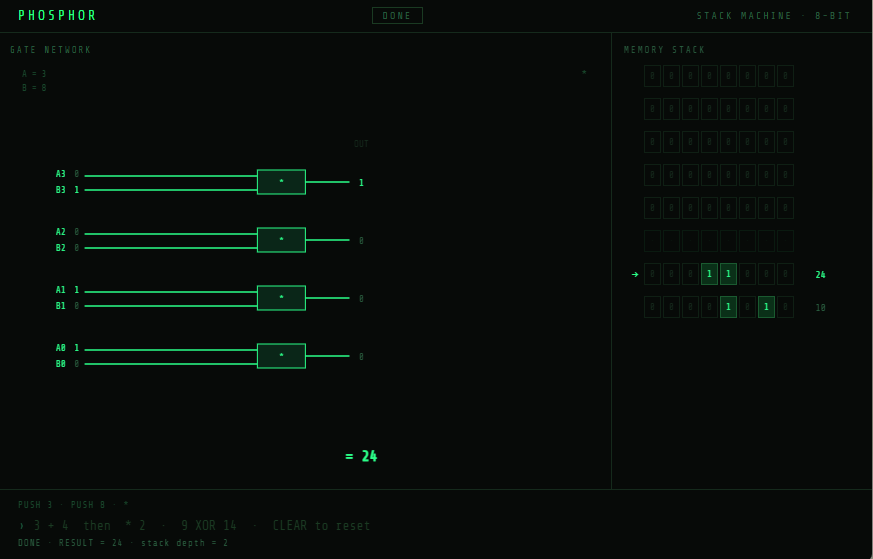

# Phosphor

A single-file, browser-based stack-machine calculator. Type an expression,
watch it get tokenized into postfix instructions, then executed one op at
a time against an 8-slot, 8-bit memory stack — with each `PUSH` and each
arithmetic/bitwise operation animated as a live gate-network diagram
(ripple-carry adder for `+`/`-`, a bitwise gate row for `AND`/`OR`/`XOR`).
Styled like a green-phosphor terminal.

No build step, no dependencies, no server. It's one HTML file with inline
CSS and vanilla JS/Canvas.



## Run

Open `phosphor.html` in a browser. That's it.

## Use

Type an expression into the input at the bottom and press Enter:

```
3 + 4
* 2
9 XOR 14
CLEAR
```

- Supports `+ - *` (arithmetic, wraps to 8-bit) and `AND`/`OR`/`XOR`
  (also accepts `& | ^`), plus parentheses and operator precedence.
- The stack **persists between expressions** — each result is pushed and
  left there, so a later expression with no operands consumes whatever's
  on top of the stack.
- Type `CLEAR` to reset the stack.
- Each op animates through the gate network panel on the left (inputs →
  pulse in → gate fires → pulse out → result) before the result lands on
  the stack panel on the right, shown as ptr/bits/decimal per cell.

## Layout

```
phosphor.html      — everything: markup, styles, and all JS (tokenizer,
                      postfix conversion, stack machine, Canvas gate-network
                      renderer, animation engine)
screenshots/        — screenshot.png, referenced above
LICENSE             — GPLv3
```

## Known limitations

- Stack is fixed at 8 slots, 8-bit values (arithmetic wraps mod 256).
- Only 4 bits of each operand are shown in the bitwise gate-row diagram
  and only 4 bits in the ripple-carry adder, even though stack values are
  8-bit — this is a deliberate legibility tradeoff, not a bug.
- No persistence — refreshing the page clears the stack.
- Not signed-integer aware; subtraction underflow wraps via two's
  complement mod 256 rather than showing negative numbers.
